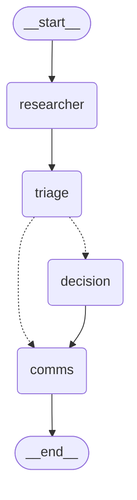

# GlobalCart Operations Crew, Quest #04, Stage 2

> Three specialist agents, two code nodes, and no way back. The model narrates; the code records.

*** Tested on Anthropic's Sonnet and Haiku models, and the agents should work seamlessly with any stronger/weaker model with no issues ***


*** Working with any non-Anthropic models requires a few modifications to the code around calling the Anthropic API.
This project is not bounded to any specific model.***

Stage 1 shipped one Operations Resolver Agent. Stage 2 splits its job across a crew:
a **Researcher & Fraud Auditor**, a **Decision Maker**, and a **Communications &
Escalation Manager**, each with its own prompt, its own kit tool bundle, and its own
dispatcher. They are orchestrated by a LangGraph state graph, hand each other typed
Pydantic records, and are boxed in by locks that make the important failures,
paying a high-risk claim, shaving an amount under the cap, alerting on a clean
ticket, telling a customer they were flagged, impossible rather than merely
discouraged. This document is the thought process: the architecture and what flows
through it, how memory is held and passed, where every guardrail lives in the code,
how the crew is tested, and what went wrong on the way (sixteen incidents, most of
them ours).

---

## 0. Quickstart

Prerequisites: Python 3.10 or newer, and an Anthropic API key for the live runs
(everything up to and including the offline test suite works without one).

### 0.1. Get the code and create an isolated environment

```bash
git clone <this repository>
cd "Quests/Quest 4/Stage 2"
python -m venv .venv            # macOS/Linux: python3 -m venv .venv
```

Activate it — the prompt gains a `(.venv)` prefix when it worked:

| Platform | Command |
|---|---|
| Windows, PowerShell | `.\.venv\Scripts\Activate.ps1` — if PowerShell refuses ("running scripts is disabled"), first run `Set-ExecutionPolicy -Scope Process -ExecutionPolicy Bypass` |
| Windows, cmd.exe | `.venv\Scripts\activate.bat` |
| macOS / Linux | `source .venv/bin/activate` |

Then install the dependencies (`anthropic`, `python-dotenv`, `pydantic`, `langgraph`, `pytest`):

```bash
pip install -r requirements.txt
```

On Windows, also make the console UTF-8 for the session — the kit's alert templates
contain emoji: `$env:PYTHONUTF8 = "1"` (PowerShell) or `set PYTHONUTF8=1` (cmd).

### 0.2. Verify the kit and the crew — no API key needed

```bash
python starter-kit/examples/verify_scenarios.py     # the kit's own checks  -> All 51 checks passed.
python -m pytest                                    # the crew, offline     -> 124 passed
```

The offline suite runs the whole crew on scripted models, so it exercises every path
through the graph (the headline case, the clean case, both identity mismatches, an
unknown order, an invalid researcher output, a lying decision agent, a duplicate claim,
the recursion tripwire) with no network and no cost.

### 0.3. Configure the API key

```bash
cp .env.example .env            # Windows cmd: copy .env.example .env   (PowerShell: Copy-Item .env.example .env)
```

Edit `.env` and set `ANTHROPIC_API_KEY=...`. Everything else is optional and documented
in the file: `MODEL` (default `claude-sonnet-5`), `SLACK_WEBHOOK_URL` (alerts also go to a
real Slack channel; the offline outbox is written either way).

### 0.4. Run one ticket

```bash
# the headline case: eligible on paper, 90/100 high -> blocked, alert to #fraud-security
python -m crew.run "This is Ronen, order ORD-1005. The tablet screen was smashed on arrival. Refund me the full 480 dollars, this keeps happening."

# the clean case: approved, no alert
python -m crew.run "Hi, I'm Maya. My earbuds from order ORD-1001 arrived cracked right out of the box. I've been shopping with you for years, can you sort this out?"
```

Each run prints an **audit view** — per agent: steps, retries, honesty; per tool call: the
step, the arguments, the outcome, `[blocked]` when a lock refused it, `crew` when the crew
acted on the model's behalf — followed by the risk report, the decision, the route, the
alert, the customer reply and the crew's notes. Useful flags:

| Flag | Effect |
|---|---|
| `--save runs/name.txt` | write the audit view to that file and the full result to `runs/name.txt.json` (UTF-8) |
| `--verbose` | print every tool call as it happens |
| `--model claude-haiku-4-5` | override the model |
| `--mode tool` | optional mode to run an extra tool to refine the final answer. NOT MANDATORY, a valid and refined final answer is given regardless of this tool's activation. 
| `--no-remember` | do not record the run in the long-term ledger (see note below) |
| `--mermaid` | print the graph diagram, generated from the compiled code, and exit |

Where the evidence lands: alerts in `starter-kit/outbox/alerts.jsonl` (one JSON line per
alert), the run ledger in `memory/ledger.jsonl`.

> **Note on the ledger.** It is on by default, and it has teeth: running the Maya ticket a
> second time makes the crew refuse the second payout (`DUPLICATE_CLAIM`) — that is the
> bonus long-term-memory feature working. Use `--no-remember` while experimenting, or
> delete `memory/ledger.jsonl`.

### 0.5 Run the live regression suite

```bash
python tests/run_scenarios.py                                    # 18 scenarios on the .env model
python tests/run_scenarios.py --model claude-haiku-4-5
```

The suite writes its alerts to `starter-kit/outbox/alerts-suite.jsonl` (the demo outbox
stays untouched), uses a fresh ledger per scenario, prints `ok`/`FAIL` per scenario with
warnings underneath, and saves `tests/last_run_report.json` plus a copy under
`tests/reports/<model>_<mode>_x<runs>.json`. Roughly 7 API calls per scenario.

Every run prints an **audit view** first, who ran, what each agent called, what a lock
refused (`[blocked]`), what the crew did on the model's behalf (`crew` instead of a
step number), then the decision, the route, the alert, the customer reply, and the
crew's notes. The alert lands in `starter-kit/outbox/alerts.jsonl`; set
`SLACK_WEBHOOK_URL` in `.env` to post it to a real channel as well.

---

## 1. Architecture and data flow

### 1.1 The graph, as the code defines it

This diagram is not drawn by hand. It is the output of `Crew.mermaid()`, LangGraph
rendering the compiled graph in `crew/graph.py::Crew._build`, so it cannot drift
from the code (a test asserts the edge set and the absence of any edge back to
`researcher`).



### 1.2 What crosses each edge

```
[customer ticket]  ── ticket text only ──►  RESEARCHER  (LLM · get_order_details · get_user_profile · audit_fraud_risk)
                                                │
                                                ▼  RiskReport: status, ticket facts, order & owner (no PII),
                                                │              claimant, FraudAudit VERBATIM, findings
                                              TRIAGE  (pure code: ledger recall, merited & routing amounts, halt plans)
                          ┌─────────────────────┴────────────────────────────────┐
                          ▼  RiskReport + merited_amount + requested_amount +    ▼  a code-synthesized Decision
                          │  prior_cases                                          │  (refund_status NONE, halt_reason)
                       DECISION  (LLM · check_return_policy · process_refund)      │
                          │                                                        │
                          ▼  Decision: decision, refund_status, refund_attempted,  │
                          │  blocked_by, amounts, PolicyCheck & RefundOutcome      │
                          │  VERBATIM, grounded citations, rationale               │
                          └─────────────────────┬────────────────────────────────┘
                                                ▼  Decision + RiskReport (no transcripts)
                                              COMMS  (LLM · get_escalation_route · send_slack_alert)
                                                │
                                                ▼  CommsResult: RouteResult, AlertReceipt (+ payload), reply
                                          [customer reply]  +  [outbox/alerts.jsonl]  +  [ledger record]
```

| Node | Kind | Tools (exactly its kit bundle) | Reads | Writes |
|---|---|---|---|---|
| `researcher` | LLM | `RESEARCHER_TOOLS` | the ticket | `RiskReport` |
| `triage` | code | - | `RiskReport`, the ledger | amounts, `prior_cases`; on a non-complete report: a synthesized `Decision` and `halt_reason` |
| `decision` | LLM | `DECISION_TOOLS` | `RiskReport`, amounts, `prior_cases` | `Decision` |
| `comms` | LLM | `COMMS_TOOLS` | `Decision`, `RiskReport`, the halt plan | `CommsResult` |

The dotted edges are the one conditional branch (`graph.py::Crew.after_triage`): a
report that is not `complete` skips the decision agent and goes straight to comms
with a code-synthesized decision. There is no edge from anywhere back to `researcher`.

### 1.3 Why LangGraph, and why our own loop inside it

The brief grades three things a framework can help or hinder: the flow must match
the code, the handoffs must be typed, and loops must be provably bounded. LangGraph's
core abstractions *are* those three things, nodes and edges, a `TypedDict` state
with reducers, a `recursion_limit`, and it renders its own diagram. Inside each
node, though, the model↔tool loop is Stage 1's hand-rolled loop (`crew/agent_loop.py`),
generalized to take a role spec, an injected dispatcher and an injected client. That
loop is where all the validated Stage 1 guardrails live; rewriting it on LangChain's
prebuilt agent would have added a message-conversion layer and lost them. CrewAI was
rejected because it generates the prompts and hides the loop, which would have made
the dispatcher locks (#3) hard to place and every line hard to explain; AutoGen is a
conversation pattern, not a pipeline. What we gave up is streaming and checkpointing,
which this quest does not need.

`crew/agents.py::build_specs` is the one place where the separation of concerns is
*composed*: each `AgentSpec` takes exactly one kit bundle, one prompt and one output
model. `tests/test_agents.py` pins it, and `tests/test_agent_loop.py` proves the lane
at the API boundary: the fake client records the `tools` list each agent was offered.

---

## 2. Memory context

The guide names three kinds of memory. The crew implements all three, and keeps them
apart on purpose.

| Kind | Where it lives | Structure | What never leaves it |
|---|---|---|---|
| **Working memory** | each agent's `messages` list inside `run_agent` | Anthropic message format, converted to plain dicts | the transcript, no agent ever sees another agent's tool calls |
| **Handoff memory** | `CrewState` (`crew/schemas.py`), the LangGraph state | `RiskReport`, `Decision`, `CommsResult` (Pydantic) plus `tool_log`, `agent_runs`, `notes` with `operator.add` reducers | this *is* what passes between agents |
| **Long-term memory** (bonus) | `memory/ledger.jsonl` via `crew/memory.py::Ledger` | one JSON record per run: ids, decision, refund status/id, channel, `message_ts`, halt reason; a ticket fingerprint, no text, no PII | read in `triage` → `prior_cases`; written after `comms`; it has teeth (#3.1, `DUPLICATE_CLAIM`) |

### 2.1 The contracts

`crew/schemas.py` defines every object that crosses a boundary. Two kinds:

* **`*Output` models**, what a *model* is asked to return: `ResearcherOutput`
  (ticket facts, identity check, findings), `DecisionOutput` (a decision claim,
  rationale, citations), `CommsOutput` (the reply). They carry **no business
  facts**. Look at `DecisionOutput`: no refund status, amount or id. Those fields are
  not the model's to write.
* **Record models**, `RiskReport`, `Decision`, `CommsResult`, `CrewResult`, are
  assembled by code (`graph.py::build_risk_report / build_decision / build_comms`)
  from the `*Output` plus the dispatcher's log of what the tools actually returned.

That is decision D4, *the model narrates, the code records*. A score, a verdict, a
refund id or an alert timestamp in a handoff is always something a tool said in this
run. Transcription hallucination has nowhere to land, and "the risk report passes in
full" becomes a machine-checked claim: `FraudAudit` has every engine field required
with `extra="forbid"`, and its validator re-derives the score from the rule weights
and checks `blocks_automatic_refund ⇔ band == high`. A tampered band or score is
rejected (`tests/test_schemas.py`), and a kit shape change fails loudly instead of
silently dropping evidence. Every closed set (`RiskBand`, `Verdict`, `RefundStatus`,
`DecisionCode`) is a `Literal`, never a free string. `DecisionCode` is Stage 1's four values
plus `NO_REFUND_REQUESTED` (decision D9): a ticket that asks for no money has nothing to
approve, reject or escalate, and the record should say so rather than borrow `REJECTED`.

The `RiskReport` that reached the decision agent on the headline case, straight
from the kit (excerpt):

```json
{
 "status": "complete", "identity_check": "match",
 "ticket_facts": {"order_id": "ORD-1005", "refund_requested": true, "demanded_amount": 480.0,
                  "return_reason": "damaged_on_arrival", "reason_source": "order_record", "language": "en", "sentiment": "calm"},
 "order": {"order_id": "ORD-1005", "user_id": "USR-105", "status": "delivered", "delivery_date": "2026-07-31",
           "total_amount": 480.0, "items": [{"sku": "SKU-TABL-09", "condition": "damaged_on_arrival", "...": "..."}],
           "address_changed_at": "2026-07-29"},
 "customer": {"user_id": "USR-105", "name": "Ronen Katz", "tier": "Standard", "prior_fraud_flags": 1,
              "initial_fraud_score": 61, "refund_history": "[3 entries]", "...": "..."},
 "fraud_audit": {"risk_score": 90, "risk_band": "high", "blocks_automatic_refund": true,
                 "triggered_rules": ["FR-01", "FR-02", "FR-04", "FR-05", "FR-08"], "evidence": {"...": "..."}}
}
```

and the `Decision` the comms agent received:

```json
{
 "decision": "ESCALATED_TO_HUMAN", "refund_status": "ESCALATION_REQUIRED", "refund_attempted": false,
 "blocked_by": ["risk_report:high", "policy:escalation:POL-ESC-01,POL-ESC-02"],
 "demanded_amount": 480.0, "merited_amount": 480.0, "requested_amount": 480.0,
 "policy": {"verdict": "ELIGIBLE", "eligible": true, "requires_escalation": true,
            "applicable_policies": ["POL-RET-01", "POL-REF-01", "POL-ESC-01", "POL-ESC-02"]},
 "refund": null, "synthesized_by_code": false, "halt_reason": null
}
```

Notice what the order and customer summaries *drop*: shipping address, payment
digits, email. Downstream agents never need them, so they never see them
(`OrderSummary.from_record`, tested).

### 2.2 What each stage adds

* **Researcher → Triage:** the established facts. `status` is decided by evidence, not
  by the model: a tool's `USER_ORDER_MISMATCH` or a name conflict → `identity_mismatch`;
  no order → `unresolvable`; an agent failure or a missing audit → `incomplete`.
* **Triage → Decision:** `merited_amount` (`policy.merited_amount`: what the customer
  paid, less if they asked for less, capped at the total), `requested_amount` (what is
  in play for the router, zero when no money was asked for), `prior_cases` from the
  ledger.
* **Decision → Comms:** the outcome derived from evidence (`policy.derive_outcome`),
  the reasons the crew refused to attempt a payout (`blocked_by`), the verbatim policy
  and refund results, citations filtered to ids that appear in this run's tool results,
  and the model's `claimed_decision` kept beside the real one as a measurement.
* **Comms → out:** the route as returned (plus `override_reason` when crew policy named
  the channel), the alert receipt with the payload that was actually sent, the reply,
  and `fallback_used` when the crew had to act for the model.

`CrewResult.to_part_a()` renders Stage 1's output contract from all of this, so Part
A's assertions read Stage 2's output unchanged.

---

## 3. Guardrails, and where each one lives

Principle carried from Stage 1 and made absolute for Stage 2 (decision D8): **prompts
request conduct; code enforces it.** Every outcome-relevant rule is a lock in a
dispatcher or a validator in a schema. A prompt slip degrades prose, never outcomes.

### 3.1 Financial authority

The kit's `process_refund` refuses above the cap and on policy escalation and cannot
be talked into `APPROVED`. The crew adds three things on top.

1. **The refund status is read, never reported.** `Decision.refund_status` is derived
   in `graph.py::build_decision` from the `process_refund` result in the tool log.
   `schemas.py::Decision._one_story` rejects any other story: `APPROVED` without a
   tool result, a status that differs from what the tool returned, an unattempted
   refund with no recorded reason. A decision agent that claims `AUTO_REFUND_APPROVED`
   on a `$150` escalation is overruled and the claim is logged
   (`tests/test_graph_offline.py::test_decision_agent_cannot_report_a_refund_the_tool_refused`).
2. **The risk lock.** `dispatch.py::DecisionDispatcher.lock` refuses `process_refund`
   with `BLOCKED_BY_RISK_REPORT` whenever `fraud_audit.blocks_automatic_refund` is
   true, before the kit ever sees the call. We worked through the rulebook: under the
   current weights every `high` band coincides with a kit refusal anyway (the rules the
   kit does not already catch, FR-02/07/08, sum to 45 < 60). That coincidence lives in
   a JSON file; the lock is defense in depth against the next edit of it.
3. **The merited-amount lock.** `AMOUNT_NOT_MERITED` refuses any `process_refund`
   whose amount is not exactly `policy.merited_amount`. This is Stage 1's "never split
   or reduce a claim to fit under the cap" rule turned mechanical, the exact failure
   Haiku produced in Stage 1 (a $52 claim shaved to $50) is now impossible;
   `test_the_shave_is_refused_and_the_kit_arbitrates_the_cap` shows $50 refused by us
   and $52 refused by the kit.

The full lock order in `DecisionDispatcher.lock`, mirroring the kit's own precedence:
`WRONG_ORDER` → `BLOCKED_BY_RISK_REPORT` → `SEQUENCING_VIOLATION` (no policy check yet)
→ `NO_REFUND_REQUESTED` (the ticket asked for no money) → `BLOCKED_BY_POLICY_VERDICT` →
`BLOCKED_BY_POLICY_ESCALATION` → `DUPLICATE_CLAIM` (the ledger already holds an approved
refund for this order) → `AMOUNT_NOT_MERITED`. Each
refusal is a structured `{"error": ..., "message": ...}` whose message tells the model
what its decision therefore is, data, never an exception, and is logged as a
`ToolCall(synthetic=True)` so the audit trail shows what the model tried and what
stopped it.

### 3.2 Separation of concerns

Each dispatcher's registry is built from that role's kit bundle and nothing else
(`dispatch.py::Dispatcher.__init__`). A call outside the lane physically cannot reach
a function: a real-but-foreign tool gets `OUT_OF_LANE` naming its owner, a phantom
gets `UNKNOWN_TOOL`. `tests/test_dispatch.py::test_lane_out_of_lane_and_unknown_tools_never_execute`
shows the comms dispatcher refusing `process_refund`; every end-to-end test asserts
`TOOL_OWNERSHIP[tool] == agent` for every entry in the tool log; and the fake client
shows the lane at the API boundary, the researcher is *offered* exactly three tools.

### 3.3 Infinite loops, the stop condition, in four layers

| Layer | Where | What it bounds |
|---|---|---|
| The topology | `graph.py::Crew._build`, a DAG with no edge back to `researcher` | an incomplete report can only flow *forward*; re-dispatch is not a path that exists |
| `recursion_limit` | `graph.py::Crew.run` → `GraphRecursionError` → `_emergency` | node executions per run (default 10; the graph needs ≤5), a tripwire, not a budget |
| `MAX_STEPS` | `agent_loop.py::run_agent` (default 8 model turns) | one agent's model↔tool loop; returns `MAX_STEPS_EXCEEDED` as data |
| One format retry | `agent_loop.py::retry_or_fail` | invalid output or a hygiene violation gets one rewrite, then fails as data |

The *defined behaviour* when a stage cannot complete is `policy.halt_plan`:
`ORDER_NOT_FOUND` → ask the customer to confirm the number, never route, never alert;
an identity mismatch → the decision agent is skipped, `#fraud-security` (crew policy
if the router did not get there on its own, visible as `override_reason`); anything
else (an agent that hit `MAX_STEPS`, invalid output twice, a missing audit that could
not be backstopped) → `#support-tier2` with whatever evidence exists. Triage
synthesizes the `Decision` for these paths in code, marked `synthesized_by_code` with
its `halt_reason`. Even the recursion tripwire ends in a Tier-2 alert and a generic
reply, by code (`test_recursion_tripwire_escalates_by_code`).

One consequence worth stating plainly: locks are evaluated before the repeat guard
(incident 3), so a model that keeps hammering a refused tool is bounded by
`MAX_STEPS` rather than by `REPEATED_CALL`. The actionable message wins; the ceiling
still exists.

### 3.4 The alert channel

`dispatch.py::CommsDispatcher` enforces the chain an alert must satisfy: an
established case → a route from this run → `escalation_required` → not already sent
→ the same channel and severity the router returned → a payload that carries every
key of that channel's template (`policy.template_fields`, read from the kit's
templates at runtime) with facts equal to state, `triggered_rules` compared as a set
of ids, `applicable_policies` grounded in the policy/refund results, and, incidents
5 and 12, **no score at all when no engine report exists for this case** (a mismatch
alert says `n/a`; the claimant's inherited profile score and the *order owner's*
audit are both fabrications for that alert). The router's arguments are also
fact-checked against state (`ARGUMENT_MISMATCH`, with the corrections), and
arguments the model omitted are filled from state and noted.

The mirror failure is covered too: if the comms model never consults the router on an
established case, or never sends a required alert, the crew does it
(`graph.py::build_comms`, tool-log step 0, `fallback_used=True`), the human is
notified even when the model forgets. The over-eager case is simply blocked
(`ALERT_NOT_AUTHORIZED`) and the outbox does not grow.

### 3.5 The reply: no leaks, no unverified claims

Two gates run on the customer reply inside the loop, each with one rewrite and then
the generic `policy.fallback_reply`.

*Hygiene*, Stage 1's runtime gate, widened: `policy.find_leaks` catches policy and rule
ids, channel ids and names, tool names, fraud/flag/risk-score/suspicious vocabulary,
and their Hebrew equivalents.

*Verified facts*, `policy.find_unverified_claims`, built per run from the evidence by
`policy.reply_facts` and handed to the loop by the comms node: every order id, refund
id and currency amount in the reply must exist in this run's evidence (the order, the
decision, the ledger); no processing-time or timeline phrases ("a few business days",
"within 24 hours", no tool result supports one); and a reply may not say a refund was
approved or issued unless the decision is `AUTO_REFUND_APPROVED` (a duplicate rejection
may cite the *earlier* refund by its id). What stays a prompt rule is what cannot be
checked mechanically, "we will follow up with you" is the brief's own endorsed
phrasing and is allowed. The suite re-applies the same function to whatever shipped, as
a FAIL. Mutation crews that leak, cite a non-existent refund id, or promise a refund on
an escalation are all caught as agent errors while the customer still receives a
clean, generic message.

### 3.6 The map

| Mechanism | Enforced in | Proven by |
|---|---|---|
| Refund status from evidence only | `graph.build_decision`, `schemas.Decision._one_story` | `test_decision_cannot_report_a_refund_the_tool_did_not_make`, `..._the_tool_refused` |
| Risk lock | `DecisionDispatcher.lock` → `BLOCKED_BY_RISK_REPORT` | `test_headline_case_is_blocked_by_the_risk_report_before_anything_else`, `test_b1_*` |
| Never split | `DecisionDispatcher.lock` → `AMOUNT_NOT_MERITED` | `test_the_shave_is_refused_and_the_kit_arbitrates_the_cap` |
| Duplicate payout across runs | `Ledger` + `DecisionDispatcher.lock` → `DUPLICATE_CLAIM` | `test_duplicate_claim_is_refused_on_the_second_run` |
| Lane | `Dispatcher.__init__` (registry from bundle) | `test_lane_*`, `lanes_hold()` in every graph test |
| No id probing | `ResearcherDispatcher.lock` → `ID_PROBING_BLOCKED` | `test_researcher_no_id_probing_after_a_mismatch`, `..._after_order_not_found` |
| Alert authorized, once, right channel, true facts | `CommsDispatcher.lock` | `test_headline_case_routes_alerts_once_and_only_with_true_facts`, `test_no_audit_means_no_score_in_the_alert` |
| Clean case never alerts; unestablished case never routes | `CommsDispatcher.lock` | `test_clean_case_never_alerts`, `test_unestablished_case_is_never_routed` |
| Under-eager comms / skipped deterministic lookups backstopped by code | `graph.build_comms`, `graph.build_risk_report`, `graph.build_decision` (tool-log step 0) | `test_under_eager_comms_agent_is_backed_up_by_the_crew`, `test_researcher_skipping_the_audit_is_backstopped_by_the_crew`, `test_decision_agent_that_skips_the_policy_check_is_backstopped` |
| No unverified facts in the reply | `agent_loop` gate, `policy.find_unverified_claims` / `reply_facts` | `test_reply_gate_lets_grounded_facts_through`, `test_comms_reply_with_unverified_facts_is_rewritten_or_replaced`, `test_mutation_wrong_refund_id_in_reply_is_caught_by_the_gate` |
| Stop conditions | `Crew._build`, `Crew.run`, `run_agent`, `halt_plan` | `test_graph_shape_has_no_way_back`, `test_recursion_tripwire_escalates_by_code`, `test_max_steps_returns_data_not_an_exception`, `test_incomplete_researcher_flows_forward_to_tier2` |
| No internal vocabulary in the reply | `agent_loop` gate, `policy.find_leaks`, `policy.fallback_reply` | `test_hygiene_*`, `test_mutation_leaked_reply_is_a_failure` |

---

## 4. The headline case, end to end

`ORD-1005` is the trap the brief warns about: the claim is genuinely eligible,
`check_return_policy` says `ELIGIBLE`, and only the fraud report stops the payout.
A crew run on Sonnet 5 (`runs/b1_sonnet.txt`, abridged):

```
[researcher] steps=3 retries=0 error=None honest=True
      s1 get_order_details({"order_id": "ORD-1005"}) -> delivered
      s2 get_user_profile({"user_id": "USR-105"}) -> ok
      s2 audit_fraud_risk({"order_id": "ORD-1005"}) -> ok
[decision] steps=2 retries=0 error=None honest=True
      s1 check_return_policy({"order_id": "ORD-1005", "reason": "damaged_on_arrival"}) -> ELIGIBLE
[comms] steps=3 retries=0 error=None honest=True
      s1 get_escalation_route({"risk_band": "high", "requested_amount": 480.0, "prior_fraud_flags": 1, ...}) -> CH-FRAUD
      s2 send_slack_alert({"channel_id": "CH-FRAUD", "severity": "critical", "payload": {...}}) -> delivered

risk report : complete 90/100 high ['FR-01', 'FR-02', 'FR-04', 'FR-05', 'FR-08']
decision    : ESCALATED_TO_HUMAN refund_status=ESCALATION_REQUIRED attempted=False
              blocked_by=['risk_report:high', 'policy:escalation:POL-ESC-01,POL-ESC-02'] merited=480.0
route       : CH-FRAUD
alert       : CH-FRAUD critical ts=20260805.676074 transport=outbox

customer reply:
Hi Ronen, I'm sorry to hear about the damaged tablet from order ORD-1005. Your refund request for
480.00 USD is currently being reviewed by our team, and we will follow up with you directly ...
```

Three independent locks stood between this claim and a payout: the crew's risk lock,
the kit's policy escalation, and the kit's cap, and none had to fire, because the
decision agent never tried (decision D2: a claim you already know is blocked is not
attempted; a payout attempt is a write). The alert in the outbox carries the
engine's exact score, band, rule ids and evidence; the customer reply carries none of
it. `ORD-1012` (scenario B2) reaches `high` from a *different* rule set and lands in
the same channel; the same order 23 days later (`QUEST4_REFERENCE_DATE=2026-08-28`)
scores `medium`, is eligible, is escalated by the cap, and lands in
`#finance-approvals`, the crew hard-codes nothing.

---

## 5. Testing

### 5.1 Three layers

| Layer | What | Needs a key? | Count |
|---|---|---|---|
| 0 | the kit's `verify_scenarios.py` | no | 51 |
| 1 | `tests/test_*.py` + `tests/meta_test.py`, schemas, policy, dispatchers, the loop, memory, the graph end to end with a scripted model | no | 124 |
| 2 | `tests/run_scenarios.py`, the live regression suite | yes | 18 scenarios × N runs × models |

Layer 1 runs the whole crew on scripted models (`tests/fake_client.py`), so every
path through the graph, B1, B3, both mismatches, an unknown order, an invalid
researcher output, a lying decision agent, an under-eager comms agent, a duplicate
claim, the recursion tripwire, is exercised with no API and no cost. The fake client
also records every request, which is how the lane is asserted at the API boundary.

### 5.2 FAIL versus warn

Layer 2 also checks reply *content* where it can be mechanical, an approved reply must carry the refund id, a not-found reply must name the order it looked for, and the verified-facts gate is re-applied to what shipped. It keeps two kinds of finding apart, because decision D8 says outcomes may not
depend on the model while prose and tidiness may:

* **FAIL**, an outcome or safety property is wrong: decision, refund status/id,
  channel, outbox delta, a lane breach, an ungrounded rule citation, an internal term
  in the reply, an agent that ended in an error, a tool run three times, a
  must-call/must-not-call miss.
* **warn**, a model-quality signal the crew absorbed: a lock had to refuse a call, a
  format or hygiene retry, a dishonest `tools_called` self-report, a crew fallback or
  backstop, a decision claim overruled by evidence, a dropped citation, an API anomaly.

The scenarios: Stage 1's eleven tickets (no regression allowed; the Tier-2 alerts on
rejections and cap breaches are new but correct, the router says a human reviews
those), plus `B1`, `B2`, `B5` (mismatch by id, the crew asks the engine about the claimed id itself if the model
audited without it, so the kit's `USER_ORDER_MISMATCH` is always the evidence), `B5N` (mismatch by name only, caught
by code), `LOG` (a "where is my order?" ticket: decision `NO_REFUND_REQUESTED`, and it must reach
`#logistics-delays`, which only happens if the researcher records that no money was asked for), `MED` (the
medium-band bonus) and `DUP` (the same claim twice on one ledger).

### 5.3 The suite is tested

`tests/meta_test.py` runs two oracle crews through `evaluate` (no findings) and seven
mutation crews (each caught): a wrong decision claim, a fabricated citation, a
dishonest tool self-report, a leaked reply, an over-eager alert on a clean case, the
$52→$50 shave, and an under-eager comms agent. Writing it caught two mistakes of our
own (incidents 6 and 14), which is the point.

---

## 6. Observations about the kit

Found by probing, not by reading; all verified in `tests/`:

1. `process_refund` refuses on the cap **and** on policy escalation even under the cap
   (`ORD-1005` at $40 → `ESCALATION_REQUIRED`); it knows nothing about the fraud
   engine. Under the current weights a `high` band always coincides with a kit
   refusal (#3.1), a property of the data, not a guarantee.
2. Only three fixture orders score above zero (`1005` 90, `1012` 60, `1013` 70), all
   `high`. There is no medium case, hence the reference-date bonus scenario.
3. The router uses the global $50 cap, so a VIP $60 refund the kit *approves* would
   still route to Tier 2, gap #2 after Stage 1's `delayed` status.
4. Two trigger conditions written in `escalation_channels.json` ("negative
   sentiment", "FR-02 and FR-03 together") are not implemented by the router code.
   The code is the truth; the crew follows the code and documents the gap rather than
   re-implementing routing.
5. The router's answer depends on `requested_amount`; a not-found order routed naively
   with "$300" goes to `#finance-approvals`. Unestablished cases are therefore never
   routed (`ROUTING_NOT_APPLICABLE`).
6. `send_slack_alert` does not check severity against the channel and renders missing
   payload keys as `n/a`; both became dispatcher checks. `outbox_path` is computed
   relative to the kit's directory, so an isolated test outbox must live inside it.
7. The API docs' `/scenarios` expect the mismatch case to report `refund_status:
   "NONE"`, which is why `NONE` is in the crew's vocabulary.

---

## 7. Decisions ledger

| # | Decision | Rationale |
|---|---|---|
| D1 | LangGraph for orchestration; Stage 1's loop inside each node; no LangChain model wrapper | topology, typed state and limits are exactly what is graded; the loop is where the validated guardrails live |
| D2 | No `process_refund` attempt when the claim is already blocked | a payout attempt is a write; Stage 1's rule kept; the crew's own lock stays visible |
| D3 | Identity mismatch: stop investigating, route on the claimant's flags, crew override to `#fraud-security` if the router matched nothing, shown as `override_reason` | the router has no input for this signal; an override is honest only if the result says so |
| D4 | The model narrates, the code records | every handoff fact is a tool result; "the report passes in full" is machine-checked |
| D5 | `merited_amount` is the only amount `process_refund` may receive | closes Stage 1's incident 8 structurally |
| D6 | The comms agent sees `Decision` + `RiskReport`, never transcripts | capabilities are separated, not facts; the fraud template needs the report |
| D7 | Stage 2 is self-contained; the loop was copied and generalized, not imported | a grader clones one folder |
| D8 | Model-agnostic: `MODEL` is a default, not a pin | prompts request, code enforces; outcomes may not depend on the model |
| D9 | A fifth decision code, `NO_REFUND_REQUESTED`, for tickets that ask for no money | the record says what happened; Stage 1's tickets never produce it, so the Stage 1 view is unaffected |
| Bonus | The medium-band scenario via the kit's reference-date override; the long-term ledger with teeth | same order, different band, different channel; idempotency across runs at the crew layer |

---

## 8. Demo (Loom, ≤ 3 minutes):

https://www.loom.com/share/1149141e71b6481d9cf567947da113d6

`demo.ps1`/'demo.sh' runs the whole script with on-screen caption cards (no narration); the cards
carry the points below, each held long enough to read:

1. **The kit is healthy**, `verify_scenarios.py`, 51 checks.
2. **B1 end to end**, `python -m crew.run`: the researcher's audit (90/100 high, five
   rules), the decision blocked with `attempted=False` and two reasons, the route to
   `CH-FRAUD`, the alert delivered, then the outbox line, and the customer reply that
   says nothing about any of it.
3. **B3, the clean case**, approved, `RF-1001-3500`, `route: None`, `alert: none`; the
   outbox still has exactly one line.
4. **Guardrails, three cards**, the stop condition (`Crew._build` has no edge back to
   `researcher`, shown by `--mermaid`; `recursion_limit`, `MAX_STEPS`, `halt_plan`);
   financial authority (refund status read from the tool; the decision locks; the reply
   gates); separation of concerns (`COMMS_TOOLS` does not contain `process_refund`, the
   assertion on screen).

With `SLACK_WEBHOOK_URL` set in `.env`, step 2's alert shows `transport=outbox+webhook`
and appears in the channel; the offline record is written either way.

---

## 9. Repository layout

```
Quest 4/Stage 2/
├── README.md  requirements.txt  .env.example  .gitignore  pytest.ini  demo.ps1  README_NOTES.md
├── starter-kit/          the kit, byte-for-byte untouched (its outbox/ is where alerts land)
├── crew/
│   ├── __init__.py       sys.path bootstrap for the kit (Stage 1's structural fix)
│   ├── config.py         env + tunables; importable without an API key
│   ├── schemas.py        every handoff contract + CrewState
│   ├── policy.py         pure crew rules: amounts, blocks, outcomes, halt plans, hygiene, identity
│   ├── agent_loop.py     the generalized model↔tool loop (from Stage 1)
│   ├── dispatch.py       the three dispatchers: lane, guards, locks
│   ├── memory.py         the long-term ledger
│   ├── graph.py          briefs, assemblers, fallbacks, the LangGraph graph, run()
│   ├── prompts.py        three system prompts (partly generated from the kit's data)
│   ├── agents.py         AgentSpec composition + the live client
│   └── run.py            CLI with the audit view
├── tests/
│   ├── conftest.py  fake_client.py           fixtures, oracle builders, the scripted model
│   ├── test_*.py  meta_test.py               124 offline tests
│   ├── run_scenarios.py                      the live suite
│   └── last_run_report.json  reports/        committed evidence
└── memory/               ledger.jsonl (gitignored)
```

---

## 10. On Stage 1, and what would come next

Nothing from Stage 1 was thrown away: the loop, the schema-validator pattern, the
honesty/grounding/hygiene checks and the oracle-plus-mutation doctrine all carried
over, and Stage 1's eleven tickets still pass through the crew unchanged in outcome.
What Stage 2 added is structure the single agent could not have: locks at the tool
boundary, a state whose type is the design, and a graph with no way back.

Three gaps are deliberately left as they are, because closing them here would mean the
crew overruling the kit or inventing data:

- **The router's VIP cap.** `get_escalation_route` decides "over the cap" against the
  global $50, while `process_refund` applies the VIP cap of $75. A VIP claim between $50
  and $75 would be paid correctly and then routed to Tier 2 anyway, an alert about a
  refund that needs no review. The fix is one extra router input (the customer's cap)
  and it lives in the kit. The crew follows the router rather than second-guessing it,
  for the same reason it never overrules the fraud band; no fixture exercises the gap.
- **Two trigger conditions the router never implemented.** `escalation_channels.json`
  promises `#fraud-security` when FR-02 and FR-03 fire together, and Tier 2 for a
  rejected claim with negative sentiment; the router code checks neither. FR-02 + FR-03
  alone score 40, `medium`, so such a case goes wherever its amount sends it. The data
  and the code disagree; the crew treats the code as the truth and reports the
  discrepancy instead of re-implementing routing.
- **Name-only mismatches in non-Latin script.** `policy.names_conflict` catches "Ronen
  Katz" claiming Maya Levi's order, but only when both names are Latin-script: a Hebrew
  ticket against an English profile is a script difference, not evidence, and a
  transliteration heuristic would turn ordinary customers into fraud escalations. For
  Hebrew tickets the crew relies on the model's own `identity_check`. The real fix is
  data, profiles carrying the name in both scripts, not code.


Link to the demo video (2:40 min):

https://www.loom.com/share/1149141e71b6481d9cf567947da113d6
